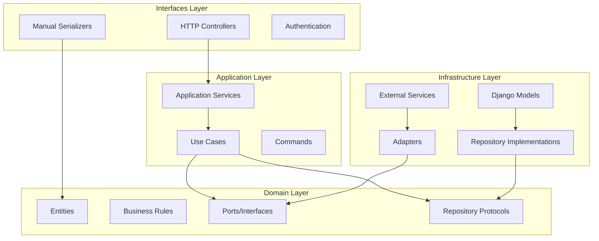

# Documento de Diseño

## Visión General

Este diseño aborda la refactorización del backend Django REST Framework para cumplir completamente con los principios de Clean Architecture. El sistema actual ya tiene una estructura hexagonal básica, pero necesita mejoras en la separación de responsabilidades, inversión de dependencias y pureza de las capas.

La arquitectura seguirá el patrón de Clean Architecture con cuatro capas principales:
- **Dominio**: Entidades, reglas de negocio, puertos y repositorios (interfaces)
- **Aplicación**: Casos de uso, servicios de aplicación y comandos
- **Infraestructura**: Adaptadores, implementaciones de repositorios, modelos ORM
- **Interfaces**: Controladores HTTP, serializadores de entrada/salida

## Arquitectura

### Principios Arquitectónicos

1. **Regla de Dependencia**: Las dependencias solo pueden apuntar hacia adentro, hacia las capas más internas
2. **Inversión de Dependencias**: Las capas internas definen interfaces que las capas externas implementan
3. **Separación de Responsabilidades**: Cada capa tiene una responsabilidad específica y bien definida
4. **Independencia de Frameworks**: La lógica de negocio no depende de Django o DRF

### Diagrama de Arquitectura



## Componentes e Interfaces

### Capa de Dominio

#### Entidades de Dominio
Las entidades representan los conceptos centrales del negocio:

```python
# app/domain/entities.py
@dataclass(frozen=True)
class Submission:
    id: UUID
    questionnaire_id: UUID
    tipo_fase: TipoFase
    regulador_id: Optional[UUID]
    placa_vehiculo: Optional[str]
    finalizado: bool
    fecha_creacion: datetime
    fecha_cierre: Optional[datetime]
    
    def finalizar(self) -> 'Submission':
        # Lógica de negocio pura
        pass

@dataclass(frozen=True) 
class Answer:
    id: UUID
    submission_id: UUID
    question_id: UUID
    answer_text: Optional[str]
    answer_choice_id: Optional[UUID]
    answer_file_path: Optional[str]
    
    def validate_invariants(self) -> None:
        # Validaciones de dominio
        pass
```

#### Puertos de Dominio
Interfaces para servicios externos:

```python
# app/domain/ports.py
class OCRService(Protocol):
    def extract_text(self, image_bytes: bytes) -> str: ...

class FileStorage(Protocol):
    def save(self, file_obj, folder: str) -> str: ...
    def delete(self, path: str) -> None: ...

class NotificationService(Protocol):
    def send_notification(self, message: str, recipient: str) -> None: ...
```

#### Repositorios de Dominio
Protocolos que definen contratos de persistencia:

```python
# app/domain/repositories.py
class SubmissionRepository(Protocol):
    def save(self, submission: Submission) -> Submission: ...
    def get_by_id(self, id: UUID) -> Optional[Submission]: ...
    def find_by_regulador(self, regulador_id: UUID) -> List[Submission]: ...

class AnswerRepository(Protocol):
    def save(self, answer: Answer) -> Answer: ...
    def get_by_submission(self, submission_id: UUID) -> List[Answer]: ...
    def delete_by_question(self, submission_id: UUID, question_id: UUID) -> int: ...
```

### Capa de Aplicación

#### Servicios de Aplicación
Orquestan casos de uso y coordinan entre repositorios:

```python
# app/application/services.py
class SubmissionService:
    def __init__(
        self,
        submission_repo: SubmissionRepository,
        answer_repo: AnswerRepository,
        ocr_service: OCRService,
        file_storage: FileStorage
    ):
        self._submission_repo = submission_repo
        self._answer_repo = answer_repo
        self._ocr_service = ocr_service
        self._file_storage = file_storage
    
    def create_submission(self, cmd: CreateSubmissionCommand) -> Submission:
        # Lógica de caso de uso
        pass
    
    def finalize_submission(self, submission_id: UUID) -> Submission:
        # Lógica de finalización
        pass
```

#### Comandos y Queries
Objetos de transferencia de datos para casos de uso:

```python
# app/application/commands.py
@dataclass(frozen=True)
class CreateSubmissionCommand:
    questionnaire_id: UUID
    tipo_fase: str
    regulador_id: Optional[UUID] = None
    placa_vehiculo: Optional[str] = None

@dataclass(frozen=True)
class SaveAnswerCommand:
    submission_id: UUID
    question_id: UUID
    answer_text: Optional[str] = None
    answer_choice_id: Optional[UUID] = None
    file_upload: Optional[Any] = None
```

### Capa de Infraestructura

#### Modelos Django
Separados de las entidades de dominio:

```python
# app/infrastructure/models.py
class SubmissionModel(models.Model):
    id = models.UUIDField(primary_key=True, default=uuid.uuid4)
    questionnaire = models.ForeignKey(QuestionnaireModel, on_delete=models.CASCADE)
    tipo_fase = models.CharField(max_length=20, choices=TIPO_FASE_CHOICES)
    # ... otros campos
    
    class Meta:
        db_table = "submission"
```

#### Implementaciones de Repositorios
Adaptan entre modelos Django y entidades de dominio:

```python
# app/infrastructure/repositories.py
class DjangoSubmissionRepository(SubmissionRepository):
    def save(self, submission: Submission) -> Submission:
        model = self._to_model(submission)
        model.save()
        return self._to_entity(model)
    
    def _to_entity(self, model: SubmissionModel) -> Submission:
        # Mapeo explícito modelo -> entidad
        pass
    
    def _to_model(self, entity: Submission) -> SubmissionModel:
        # Mapeo explícito entidad -> modelo
        pass
```

#### Adaptadores de Servicios Externos
Implementan puertos de dominio:

```python
# app/infrastructure/adapters.py
class GoogleVisionOCRService(OCRService):
    def extract_text(self, image_bytes: bytes) -> str:
        # Implementación específica de Google Vision
        pass

class DjangoFileStorage(FileStorage):
    def save(self, file_obj, folder: str) -> str:
        # Implementación usando Django storage
        pass
```

### Capa de Interfaces

#### Controladores HTTP
Manejan solo preocupaciones HTTP:

```python
# app/interfaces/views.py
class SubmissionViewSet(viewsets.ViewSet):
    def __init__(self, *args, **kwargs):
        super().__init__(*args, **kwargs)
        self._submission_service = self._get_submission_service()
    
    def create(self, request):
        serializer = CreateSubmissionSerializer(data=request.data)
        serializer.is_valid(raise_exception=True)
        
        cmd = CreateSubmissionCommand(**serializer.validated_data)
        submission = self._submission_service.create_submission(cmd)
        
        return Response(
            SubmissionResponseSerializer(submission).data,
            status=status.HTTP_201_CREATED
        )
    
    def _get_submission_service(self) -> SubmissionService:
        # Factory method para inyección de dependencias
        pass
```

#### Serializadores Manuales
No heredan de ModelSerializer:

```python
# app/interfaces/serializers.py
class CreateSubmissionSerializer(serializers.Serializer):
    questionnaire_id = serializers.UUIDField()
    tipo_fase = serializers.ChoiceField(choices=['entrada', 'salida'])
    regulador_id = serializers.UUIDField(required=False, allow_null=True)
    placa_vehiculo = serializers.CharField(required=False, allow_blank=True)

class SubmissionResponseSerializer(serializers.Serializer):
    id = serializers.UUIDField()
    questionnaire_id = serializers.UUIDField()
    tipo_fase = serializers.CharField()
    finalizado = serializers.BooleanField()
    fecha_creacion = serializers.DateTimeField()
```

## Modelos de Datos

### Entidades de Dominio vs Modelos de Infraestructura

Las entidades de dominio son inmutables y contienen lógica de negocio:
- Usan `@dataclass(frozen=True)` para inmutabilidad
- Contienen métodos de validación y reglas de negocio
- No tienen dependencias externas

Los modelos de infraestructura son mutables y manejan persistencia:
- Heredan de `models.Model` de Django
- Contienen solo configuración de base de datos
- Se mapean explícitamente a/desde entidades de dominio

### Mapeo Entre Capas

```python
# Ejemplo de mapeo explícito
def submission_model_to_entity(model: SubmissionModel) -> Submission:
    return Submission(
        id=model.id,
        questionnaire_id=model.questionnaire_id,
        tipo_fase=TipoFase(model.tipo_fase),
        regulador_id=model.regulador_id,
        placa_vehiculo=model.placa_vehiculo,
        finalizado=model.finalizado,
        fecha_creacion=model.fecha_creacion,
        fecha_cierre=model.fecha_cierre
    )
```

## Manejo de Errores

### Jerarquía de Excepciones

```python
# app/domain/exceptions.py
class DomainException(Exception):
    """Excepción base del dominio"""
    pass

class ValidationError(DomainException):
    """Error de validación de reglas de negocio"""
    pass

class EntityNotFoundError(DomainException):
    """Entidad no encontrada"""
    pass

class BusinessRuleViolationError(DomainException):
    """Violación de regla de negocio"""
    pass
```

### Traducción de Excepciones

```python
# app/interfaces/exception_handlers.py
def translate_domain_exception(exc: DomainException) -> Response:
    if isinstance(exc, ValidationError):
        return Response(
            {"error": str(exc)}, 
            status=status.HTTP_400_BAD_REQUEST
        )
    elif isinstance(exc, EntityNotFoundError):
        return Response(
            {"error": str(exc)}, 
            status=status.HTTP_404_NOT_FOUND
        )
    # ... más traducciones
```

## Estrategia de Pruebas

### Pruebas de Dominio
- Pruebas unitarias puras sin dependencias externas
- Verifican lógica de negocio y validaciones
- Usan solo entidades y reglas de dominio

### Pruebas de Aplicación
- Usan mocks para repositorios y servicios externos
- Verifican orquestación de casos de uso
- Prueban manejo de errores y flujos de trabajo

### Pruebas de Infraestructura
- Prueban implementaciones de repositorios contra base de datos real
- Verifican adaptadores de servicios externos
- Prueban mapeo entre modelos y entidades

### Pruebas de Interfaces
- Prueban controladores HTTP con servicios mockeados
- Verifican serialización/deserialización
- Prueban autenticación y autorización

### Pruebas Arquitectónicas
- Verifican que las dependencias fluyan en la dirección correcta
- Detectan violaciones de límites entre capas
- Usan herramientas como `import-linter` para validar arquitectura

## Inyección de Dependencias

### Factory Pattern
```python
# app/infrastructure/factories.py
class ServiceFactory:
    @staticmethod
    def create_submission_service() -> SubmissionService:
        submission_repo = DjangoSubmissionRepository()
        answer_repo = DjangoAnswerRepository()
        ocr_service = GoogleVisionOCRService()
        file_storage = DjangoFileStorage()
        
        return SubmissionService(
            submission_repo=submission_repo,
            answer_repo=answer_repo,
            ocr_service=ocr_service,
            file_storage=file_storage
        )
```

### Configuración en Views
```python
# app/interfaces/views.py
class BaseViewSet(viewsets.ViewSet):
    def __init__(self, *args, **kwargs):
        super().__init__(*args, **kwargs)
        self._factory = ServiceFactory()
    
    def get_submission_service(self) -> SubmissionService:
        return self._factory.create_submission_service()
```

## Migración Incremental

### Fase 1: Separación de Entidades
1. Crear entidades de dominio inmutables
2. Implementar mapeo entre modelos y entidades
3. Actualizar repositorios para usar entidades

### Fase 2: Purificación de Servicios
1. Refactorizar servicios de aplicación para usar solo interfaces de dominio
2. Implementar inyección de dependencias
3. Crear adaptadores para servicios externos

### Fase 3: Refactorización de Interfaces
1. Convertir ModelSerializer a serializadores manuales
2. Simplificar controladores para delegar a servicios de aplicación
3. Implementar manejo consistente de errores

### Fase 4: Pruebas y Validación
1. Implementar pruebas arquitectónicas
2. Agregar pruebas unitarias para cada capa
3. Validar cumplimiento de Clean Architecture