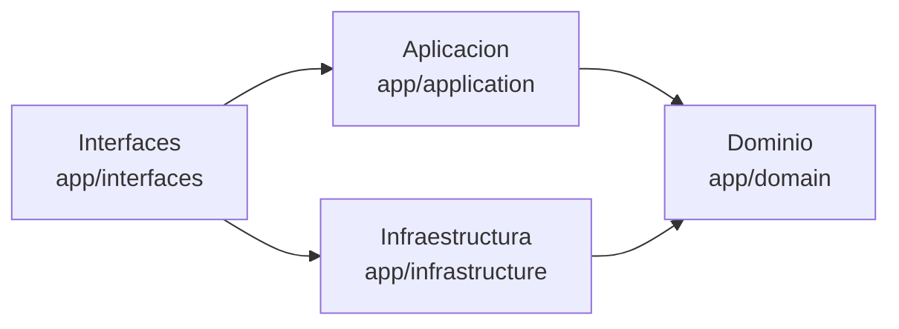
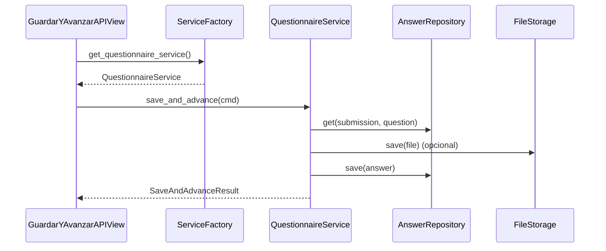
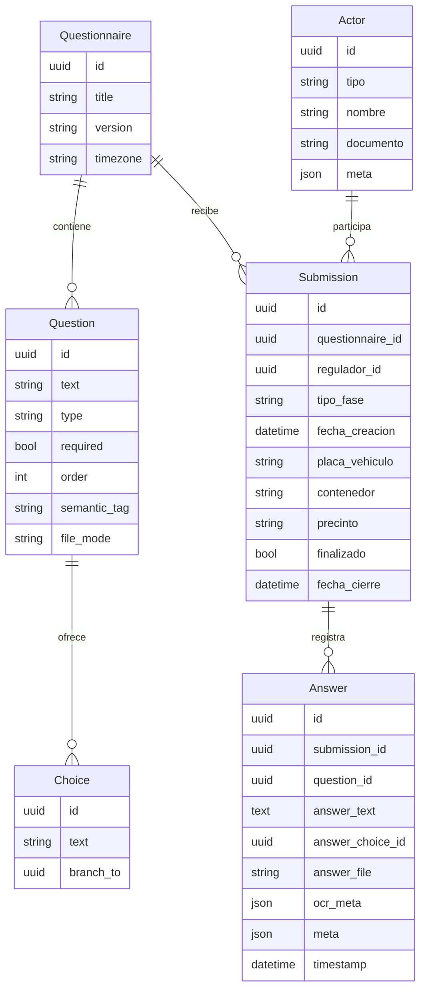
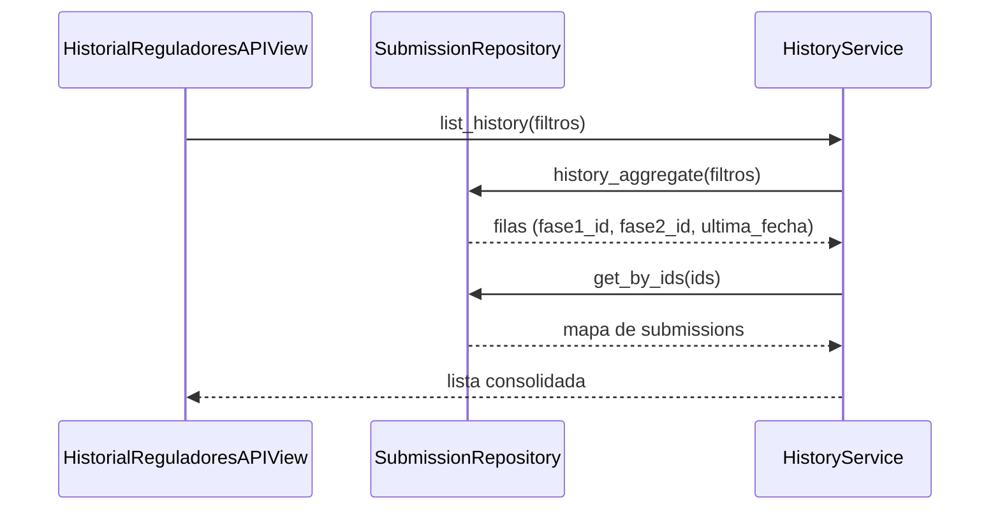

# Diagramas y Modelos

## Vista de capas

## Flujo Guardar y Avanzar

## Modelo de datos principal

## Interaccion para historico por regulador

Estos diagramas resumen las relaciones clave y el flujo de mensajes mas relevante para comprender la plataforma.
