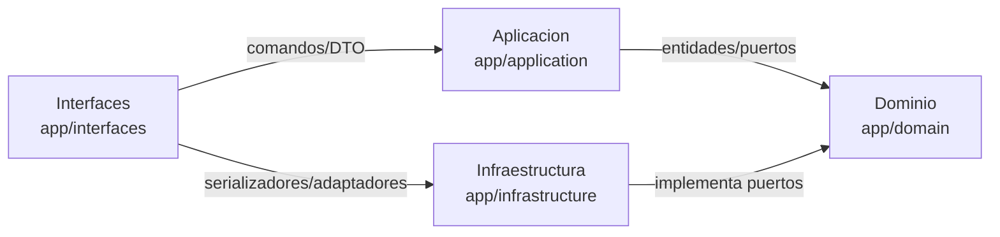
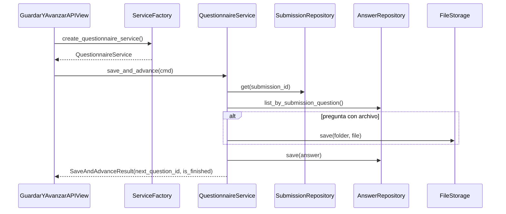
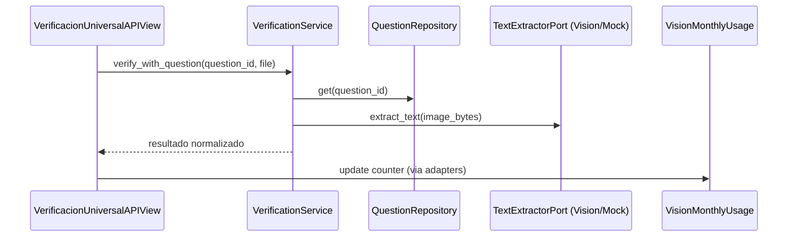
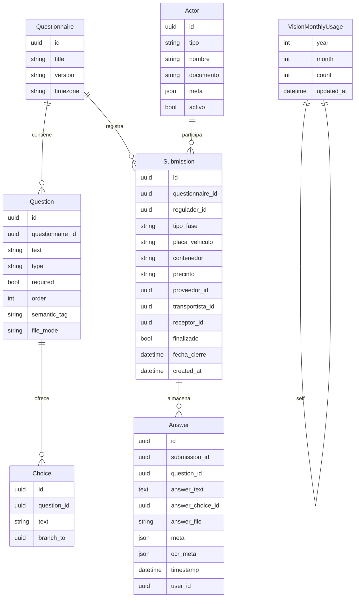
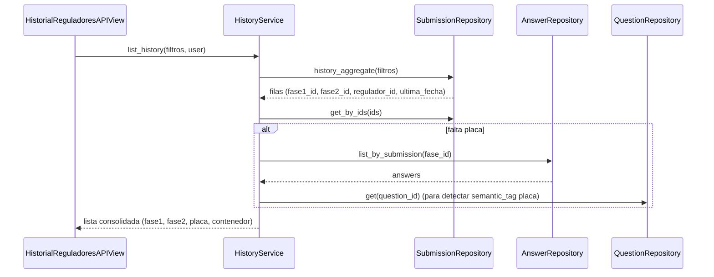

# Diagramas y Modelos

## Vista de capas

## Flujo Guardar y Avanzar

## Verificacion OCR y contador mensual

## Modelo de datos

## Historial por regulador

Estos diagramas describen las interacciones principales del backend y sirven como referencia para nuevos colaboradores y tareas de soporte.
