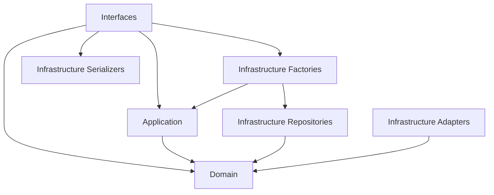

# Clean Architecture Guide

## Overview

This project follows Clean Architecture principles with four distinct layers that maintain proper dependency direction and separation of concerns.

## Layer Structure

```
app/
├── domain/          # Core business logic (innermost layer)
├── application/     # Use cases and application services
├── infrastructure/  # External concerns (database, APIs, etc.)
└── interfaces/      # HTTP controllers and serializers (outermost layer)
```

## Dependency Rules

### The Dependency Rule
Dependencies can only point inward. That is, source code dependencies can only point toward higher-level policies.

- **Domain** → No external dependencies
- **Application** → Can depend on Domain only
- **Infrastructure** → Can depend on Domain and Application (for factories)
- **Interfaces** → Can depend on Application, Domain, and Infrastructure (for factories and serializers)

### Allowed Dependencies



## Naming Conventions

### Domain Layer (`app/domain/`)

#### Entities
- **Pattern**: `{EntityName}` (e.g., `Submission`, `Answer`, `Question`)
- **File**: `entities.py`
- **Characteristics**: 
  - Immutable dataclasses (`@dataclass(frozen=True)`)
  - Contain business rules and validation methods
  - No external dependencies

```python
@dataclass(frozen=True)
class Submission:
    id: UUID
    questionnaire_id: UUID
    finalizado: bool
    
    def finalizar(self) -> 'Submission':
        """Business rule for finalizing submission."""
        return replace(self, finalizado=True)
```

#### Repository Protocols
- **Pattern**: `{EntityName}Repository` (e.g., `SubmissionRepository`, `AnswerRepository`)
- **File**: `repositories.py`
- **Characteristics**: 
  - Protocol classes defining interfaces
  - Only method signatures, no implementations

```python
class SubmissionRepository(Protocol):
    def get(self, id: UUID) -> Optional[Submission]: ...
    def save(self, submission: Submission) -> Submission: ...
```

#### Ports (External Service Interfaces)
- **Pattern**: `{ServiceName}Port` or `{ServiceName}` (e.g., `TextExtractorPort`, `FileStorage`)
- **File**: `ports.py`
- **Characteristics**: 
  - Protocol classes for external services
  - Abstract interfaces for infrastructure adapters

```python
class TextExtractorPort(Protocol):
    def extract_text(self, image_bytes: bytes) -> str: ...
```

#### Domain Exceptions
- **Pattern**: `{ErrorType}Error` (e.g., `ValidationError`, `EntityNotFoundError`)
- **File**: `exceptions.py`
- **Characteristics**: 
  - Inherit from base `DomainException`
  - Contain domain-specific error information

### Application Layer (`app/application/`)

#### Services
- **Pattern**: `{EntityName}Service` (e.g., `SubmissionService`, `AnswerService`)
- **File**: `services.py`
- **Characteristics**: 
  - Orchestrate use cases
  - Depend only on domain interfaces
  - Use constructor injection for dependencies

```python
class SubmissionService:
    def __init__(
        self,
        submission_repo: SubmissionRepository,
        answer_repo: AnswerRepository
    ):
        self._submission_repo = submission_repo
        self._answer_repo = answer_repo
```

#### Commands and Queries
- **Pattern**: `{Action}Command` or `{Action}Query` (e.g., `CreateSubmissionCommand`)
- **File**: `commands.py`, `queries.py`
- **Characteristics**: 
  - Immutable data transfer objects
  - Represent user intentions

```python
@dataclass(frozen=True)
class CreateSubmissionCommand:
    questionnaire_id: UUID
    tipo_fase: str
    regulador_id: Optional[UUID] = None
```

### Infrastructure Layer (`app/infrastructure/`)

#### Models (ORM)
- **Pattern**: `{EntityName}Model` or `{EntityName}` (e.g., `SubmissionModel`, `Submission`)
- **File**: `models.py`
- **Characteristics**: 
  - Django model classes
  - Database-specific concerns only
  - Separate from domain entities

#### Repository Implementations
- **Pattern**: `Django{EntityName}Repository` (e.g., `DjangoSubmissionRepository`)
- **File**: `repositories.py`
- **Characteristics**: 
  - Implement domain repository protocols
  - Handle ORM operations
  - Include explicit mapping functions

```python
class DjangoSubmissionRepository(SubmissionRepository):
    def save(self, submission: Submission) -> Submission:
        model = self._entity_to_model(submission)
        model.save()
        return self._model_to_entity(model)
    
    def _entity_to_model(self, entity: Submission) -> SubmissionModel:
        # Explicit mapping logic
        pass
```

#### Adapters
- **Pattern**: `{ServiceName}Adapter` (e.g., `GoogleVisionAdapter`, `DjangoFileStorageAdapter`)
- **File**: Individual files or `adapters/` directory
- **Characteristics**: 
  - Implement domain ports
  - Handle external service integration
  - Translate between external APIs and domain interfaces

#### Factories
- **Pattern**: `ServiceFactory`, `{Context}Factory`
- **File**: `factories.py`
- **Characteristics**: 
  - Centralize dependency injection
  - Create and wire application services
  - Can import application services (acceptable pattern)

```python
class ServiceFactory:
    def create_submission_service(self) -> SubmissionService:
        return SubmissionService(
            submission_repo=self._get_submission_repository(),
            answer_repo=self._get_answer_repository()
        )
```

### Interfaces Layer (`app/interfaces/`)

#### HTTP Controllers
- **Pattern**: `{EntityName}ViewSet` or `{Action}APIView` (e.g., `SubmissionViewSet`)
- **File**: `views.py`
- **Characteristics**: 
  - Handle HTTP concerns only
  - Delegate business logic to application services
  - Use factories for service creation

```python
class SubmissionViewSet(viewsets.ViewSet):
    def create(self, request):
        # 1. Validate input
        serializer = CreateSubmissionSerializer(data=request.data)
        serializer.is_valid(raise_exception=True)
        
        # 2. Create command
        cmd = CreateSubmissionCommand(**serializer.validated_data)
        
        # 3. Delegate to service
        factory = get_service_factory()
        service = factory.create_submission_service()
        submission = service.create_submission(cmd)
        
        # 4. Return response
        return Response(
            SubmissionResponseSerializer(submission).data,
            status=status.HTTP_201_CREATED
        )
```

#### Serializers
- **Pattern**: 
  - Input: `{Action}Serializer` (e.g., `CreateSubmissionSerializer`)
  - Output: `{EntityName}ResponseSerializer` (e.g., `SubmissionResponseSerializer`)
  - Domain: `Domain{EntityName}Serializer` (e.g., `DomainSubmissionSerializer`)
- **File**: `entity_serializers.py` (for domain entities), others in infrastructure
- **Characteristics**: 
  - Manual serializers (not ModelSerializer)
  - Work with domain entities when possible
  - Handle HTTP input/output concerns

## Architectural Patterns

### 1. Repository Pattern
- Domain defines interfaces (protocols)
- Infrastructure provides implementations
- Application services depend on interfaces, not implementations

### 2. Dependency Injection via Factory Pattern
- Factories in infrastructure layer wire up dependencies
- Services receive dependencies through constructor injection
- Views use factories to get configured services

### 3. Explicit Mapping
- Clear separation between domain entities and infrastructure models
- Explicit mapping functions in repository implementations
- No automatic ORM mapping in domain layer

### 4. Command/Query Separation
- Commands represent write operations
- Queries represent read operations
- Both are immutable data structures

### 5. Port/Adapter Pattern
- Domain defines ports (interfaces) for external services
- Infrastructure provides adapters that implement ports
- Enables easy testing and service substitution

## Testing Strategy

### Domain Layer Tests
- Pure unit tests with no external dependencies
- Test business rules and entity behavior
- Fast execution, no database or network calls

### Application Layer Tests
- Use mocks for repository and port dependencies
- Test use case orchestration
- Verify proper delegation to domain services

### Infrastructure Layer Tests
- Test repository implementations against real database
- Test adapter implementations against external services
- Verify mapping between entities and models

### Interface Layer Tests
- Test HTTP controllers with mocked services
- Verify request/response handling
- Test authentication and authorization

## Import Linter Configuration

The project uses `import-linter` to enforce architectural boundaries:

```toml
[tool.importlinter]
root_package = "app"
include_external_packages = true

# Domain layer must be pure
[[tool.importlinter.contracts]]
name = "Domain layer independence"
type = "forbidden"
source_modules = ["app.domain"]
forbidden_modules = ["django", "rest_framework", "app.infrastructure", "app.interfaces", "app.application"]

# Application layer can only depend on domain
[[tool.importlinter.contracts]]
name = "Application layer dependencies"
type = "forbidden"
source_modules = ["app.application"]
forbidden_modules = ["django", "rest_framework", "app.infrastructure", "app.interfaces"]
```

### Acceptable "Violations"

Some import-linter warnings are acceptable architectural patterns:

1. **Factory imports of application services**: Infrastructure factories can import application services for dependency injection
2. **Transitive dependencies through serializers**: Interfaces can use infrastructure serializers that depend on models
3. **Transitive dependencies through factories**: Interfaces can use factories that depend on repositories and models

## Best Practices

### 1. Keep Domain Pure
- No framework dependencies in domain layer
- Use only standard library and typing modules
- Business logic should be testable without external setup

### 2. Use Explicit Mapping
- Always map between layers explicitly
- Don't expose ORM models to application layer
- Create clear transformation functions

### 3. Dependency Injection
- Services should receive dependencies via constructor
- Use factories to wire up complex dependency graphs
- Avoid service locator pattern

### 4. Error Handling
- Use domain-specific exceptions
- Translate infrastructure exceptions to domain exceptions
- Handle errors at appropriate layer boundaries

### 5. Testing
- Write tests for each layer independently
- Use mocks to isolate layers during testing
- Maintain fast feedback loops with pure domain tests

## Migration Guidelines

When adding new features:

1. **Start with Domain**: Define entities, rules, and interfaces
2. **Add Application Logic**: Create services and use cases
3. **Implement Infrastructure**: Add repositories and adapters
4. **Create Interfaces**: Add controllers and serializers
5. **Write Tests**: Test each layer independently

When refactoring existing code:

1. **Extract Domain Logic**: Move business rules to domain entities
2. **Create Repository Interfaces**: Define protocols in domain
3. **Implement Repositories**: Move ORM logic to infrastructure
4. **Refactor Services**: Use dependency injection
5. **Update Controllers**: Delegate to services, handle only HTTP concerns