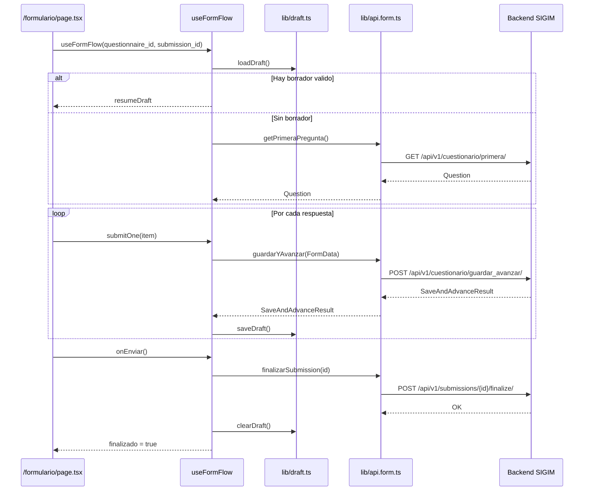
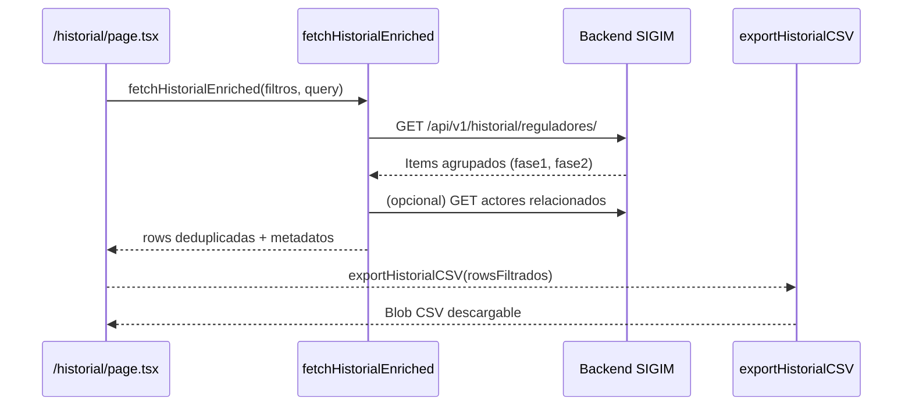
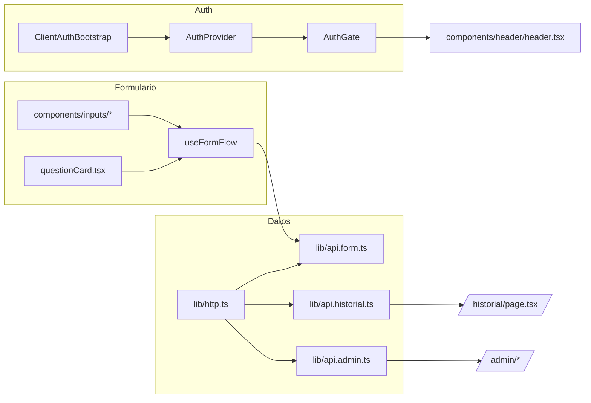

# Diagramas y Modelos

## Estructura de rutas
```mermaid
graph TD
    A[RootLayout<br/>src/app/layout.tsx] -->|Protege| B[(middleware.ts)]
    A --> C(/login)
    A --> D(/formulario)
    A --> E(/historial)
    A --> F(/panel)
    A --> G(/admin)
    A --> H(/):::home

    subgraph Auth Context
        C --> I[AuthProvider]
        I --> J[AuthGate]
    end

    classDef home fill=#f5f5f5,stroke=#999,color=#111;
```

## Flujo Guardar y Avanzar en el cliente


## Historial enriquecido y exportacion


## Diagrama de componentes principales


